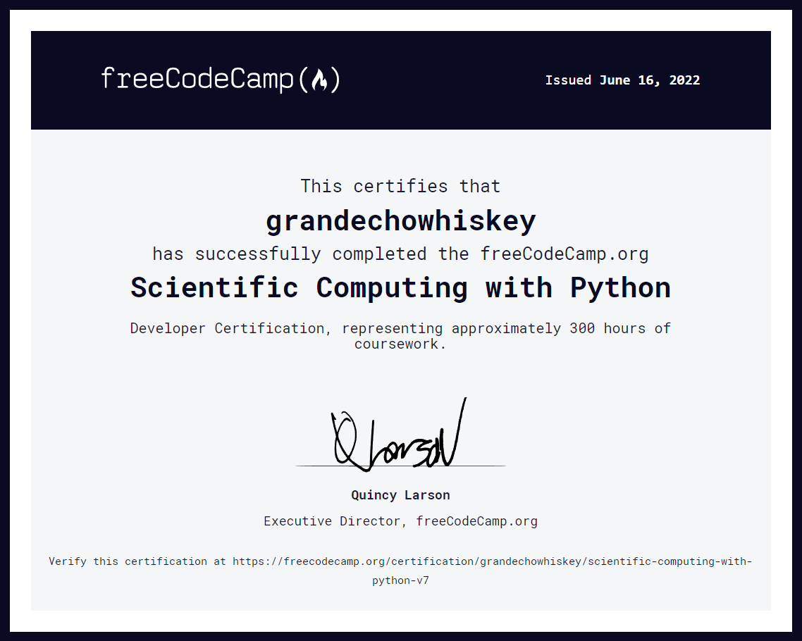

[<- Back to main](https://github.com/GrandEchoWhiskey)

<a href="https://www.freecodecamp.org/learn/scientific-computing-with-python">
   
</a>

<h1 align="center">Scientific Computing with Python</h1>

 

#### freeCodeCamp course on [freecodecamp.org/learn/scientific-computing-with-python][fcc_link]
##### Certificate link: [click here][certificate_link]

---

## Boilerplates:
Name | Description | Technology
:--- | :--- | :---:
[Arithmetic Formatter][arithmetic_link] | Arithmetic formating of addition and substraction vertically arranged | [![Python][py_img]](#)
[Time Calculator][time_link] | Calculating what time in AM/PM, day and dayname will be in given duration | [![Python][py_img]](#)
[Budget App][budget_link] | Calcutale incomming and outgoing transactions, withdraws, and deposits | [![Python][py_img]](#)
[Polygon Area Calculator][polygon_link] | Calculate how many polygons can be fit into another polygon | [![Python][py_img]](#)
[Probability Calculator][probability_link] | Calculate the probability of drawing a ball from the hat | [![Python][py_img]](#)

  
---

<!-- Links -->

[fcc_link]: https://www.freecodecamp.org/learn/scientific-computing-with-python
[certificate_link]: https://www.freecodecamp.org/certification/grandechowhiskey/scientific-computing-with-python-v7

[arithmetic_link]:    bpl-1-arithmetic-formatter
[time_link]:          bpl-2-time-calculator
[budget_link]:        bpl-3-budget-app
[polygon_link]:       bpl-4-polygon-area-calculator
[probability_link]:   bpl-5-probability-calculator

[py_img]: https://github.com/GrandEchoWhiskey/grandechowhiskey/blob/main/icons/programming/python.png
